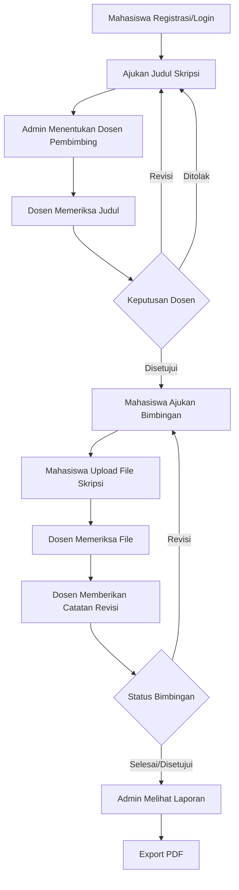

<div align="center">

# 🎓 SIBIMBINGAN

### Sistem Bimbingan Skripsi Online Berbasis Laravel

Aplikasi web modern untuk mengelola proses **pengajuan judul**, **penentuan dosen pembimbing**, **bimbingan skripsi**, **upload file**, **catatan revisi**, dan **laporan bimbingan** secara online.

<br>


</div>

---

## 📌 Tentang Project

**SIBIMBINGAN** adalah sistem informasi bimbingan skripsi online yang dibuat untuk mempermudah proses akademik antara **mahasiswa**, **dosen pembimbing**, dan **admin**.

Dengan sistem ini, mahasiswa dapat mengajukan judul skripsi, melakukan bimbingan, mengunggah file skripsi, dan melihat catatan revisi dari dosen. Dosen dapat memeriksa judul, memeriksa file, memberikan revisi, serta mengubah status bimbingan. Admin dapat mengatur data pengajuan, menentukan dosen pembimbing, dan melihat laporan bimbingan.

---

## ✨ Fitur Unggulan

| Fitur                        | Keterangan                                           |
| ---------------------------- | ---------------------------------------------------- |
| Multi Role Login             | Sistem memiliki role Admin, Mahasiswa, dan Dosen     |
| Registrasi Mahasiswa & Dosen | Mahasiswa dan dosen dapat membuat akun sendiri       |
| Pengajuan Judul Skripsi      | Mahasiswa dapat mengajukan judul secara online       |
| Penentuan Dosen Pembimbing   | Admin dapat menentukan dosen pembimbing              |
| Bimbingan Online             | Mahasiswa dapat mengajukan bimbingan dan upload file |
| Catatan Revisi               | Dosen dapat memberikan revisi kepada mahasiswa       |
| Status Progress              | Mahasiswa dapat melihat perkembangan bimbingan       |
| Grafik Dashboard Dosen       | Dosen dapat melihat visualisasi status bimbingan     |
| Laporan Bimbingan            | Admin dapat melihat dan mencetak laporan             |
| Export PDF                   | Laporan dapat diexport dalam bentuk PDF              |

---

## 👥 Role dan Hak Akses

### 👨‍💼 Admin

Admin berperan sebagai pengelola utama sistem.

* Melihat dashboard utama
* Melihat statistik mahasiswa, dosen, pengajuan, dan bimbingan
* Mengelola pengajuan judul
* Menentukan dosen pembimbing
* Melihat laporan bimbingan
* Export laporan bimbingan ke PDF

### 🎓 Mahasiswa

Mahasiswa berperan sebagai pengguna yang mengajukan dan menjalani proses bimbingan skripsi.

* Registrasi akun mahasiswa
* Login ke dashboard mahasiswa
* Mengajukan judul skripsi
* Melihat status pengajuan judul
* Melihat dosen pembimbing
* Mengajukan bimbingan skripsi
* Upload file proposal atau BAB skripsi
* Melihat catatan revisi dosen
* Melihat progress bimbingan

### 👨‍🏫 Dosen

Dosen berperan sebagai pembimbing yang memeriksa pengajuan dan file mahasiswa.

* Registrasi akun dosen
* Login ke dashboard dosen
* Melihat pengajuan judul mahasiswa
* Memberikan keputusan judul
* Melihat file skripsi mahasiswa
* Memberikan catatan revisi
* Mengubah status bimbingan
* Melihat grafik status bimbingan

---

## 🧭 Alur Sistem



---

## 🔄 Detail Alur Penggunaan

### Alur Mahasiswa

1. Mahasiswa membuat akun melalui halaman register.
2. Mahasiswa login ke sistem.
3. Mahasiswa mengajukan judul skripsi.
4. Mahasiswa menunggu admin menentukan dosen pembimbing.
5. Setelah dosen ditentukan, pengajuan akan masuk ke dashboard dosen.
6. Dosen memberikan keputusan terhadap judul.
7. Jika judul disetujui, mahasiswa dapat mengajukan bimbingan.
8. Mahasiswa mengunggah file skripsi.
9. Dosen memberikan catatan revisi atau persetujuan.
10. Mahasiswa melihat status bimbingan melalui dashboard.

### Alur Dosen

1. Dosen membuat akun melalui halaman register.
2. Dosen login ke sistem.
3. Dosen melihat daftar pengajuan judul mahasiswa.
4. Dosen memberikan status judul.
5. Dosen melihat data bimbingan mahasiswa.
6. Dosen membuka file yang diupload mahasiswa.
7. Dosen memberikan catatan revisi.
8. Dosen mengubah status bimbingan.

### Alur Admin

1. Admin login ke sistem.
2. Admin melihat dashboard utama.
3. Admin melihat daftar pengajuan judul.
4. Admin menentukan dosen pembimbing.
5. Admin memantau proses bimbingan.
6. Admin melihat laporan bimbingan.
7. Admin mencetak laporan dalam bentuk PDF.

---

## 📊 Status Bimbingan

| Status    | Keterangan                                  |
| --------- | ------------------------------------------- |
| Menunggu  | Bimbingan baru diajukan dan belum diperiksa |
| Diproses  | File sedang diperiksa oleh dosen            |
| Revisi    | Mahasiswa harus memperbaiki file            |
| Selesai   | Tahapan bimbingan telah selesai             |
| Disetujui | File atau bimbingan telah disetujui         |

---

## 🛠️ Teknologi yang Digunakan

| Teknologi      | Fungsi                         |
| -------------- | ------------------------------ |
| Laravel 13     | Framework utama backend        |
| PHP 8.4        | Bahasa pemrograman server-side |
| MySQL          | Database                       |
| Laravel Breeze | Authentication                 |
| Blade          | Template engine                |
| Tailwind CSS   | Styling UI modern              |
| Vite           | Frontend build tool            |
| Composer       | Dependency manager PHP         |
| NPM            | Dependency manager frontend    |
| DomPDF         | Export laporan ke PDF          |

---

## 📂 Struktur Folder Penting

```text
sibimbingan-laravel
├── app
│   ├── Http
│   │   ├── Controllers
│   │   │   ├── Admin
│   │   │   ├── Auth
│   │   │   ├── Dosen
│   │   │   └── Mahasiswa
│   │   └── Middleware
│   └── Models
├── database
│   ├── migrations
│   └── seeders
├── public
│   └── images
├── resources
│   └── views
│       ├── admin
│       ├── auth
│       ├── dosen
│       ├── mahasiswa
│       └── layouts
├── routes
│   └── web.php
├── storage
├── .env.example
├── composer.json
├── package.json
└── README.md
```

---

# 🚀 Cara Clone dan Menjalankan Project

Bagian ini digunakan untuk teman yang ingin menjalankan project di laptop atau komputer masing-masing.

---

## 1. Software yang Harus Diinstall

Pastikan sudah menginstall:

* PHP
* Composer
* Node.js
* NPM
* MySQL
* Laragon atau XAMPP
* Git

Cek dengan perintah:

```bash
php -v
composer -V
node -v
npm -v
git --version
```

---

## 2. Clone Repository

```bash
git clone https://github.com/afrinoer12/sibimbingan-laravel.git
```

Masuk ke folder project:

```bash
cd sibimbingan-laravel
```

> Jika nama repository berbeda, ganti URL repository sesuai link GitHub project.

---

## 3. Install Dependency Laravel

```bash
composer install
```

---

## 4. Install Dependency Frontend

```bash
npm install
```

---

## 5. Copy File Environment

Untuk Windows CMD atau PowerShell:

```bash
copy .env.example .env
```

Untuk Git Bash, Linux, atau Mac:

```bash
cp .env.example .env
```

---

## 6. Generate Application Key

```bash
php artisan key:generate
```

---

## 7. Buat Database

Buka phpMyAdmin, lalu buat database baru:

```text
db_bimbingan_skripsi
```

Kemudian buka file `.env`, lalu sesuaikan konfigurasi database:

```env
DB_CONNECTION=mysql
DB_HOST=127.0.0.1
DB_PORT=3306
DB_DATABASE=db_bimbingan_skripsi
DB_USERNAME=root
DB_PASSWORD=
```

Jika MySQL memakai password, isi bagian:

```env
DB_PASSWORD=password_mysql_kamu
```

---

## 8. Jalankan Migration

```bash
php artisan migrate
```

Jika ingin mengulang database dari awal:

```bash
php artisan migrate:fresh
```

---

## 9. Buat Storage Link

```bash
php artisan storage:link
```

Perintah ini diperlukan agar file skripsi yang diupload dapat dibuka melalui browser.

---

## 10. Jalankan Vite

```bash
npm run dev
```

Biarkan terminal ini tetap berjalan.

---

## 11. Jalankan Laravel Server

Buka terminal baru, lalu jalankan:

```bash
php artisan serve
```

Akses project melalui browser:

```text
http://127.0.0.1:8000
```

---

# ⚡ Perintah Cepat Setelah Clone

## Windows CMD / PowerShell

```bash
git clone https://github.com/afrinoer12/sibimbingan-laravel.git
cd sibimbingan-laravel
composer install
npm install
copy .env.example .env
php artisan key:generate
php artisan migrate
php artisan storage:link
npm run dev
php artisan serve
```

## Git Bash / Linux / Mac

```bash
git clone https://github.com/afrinoer12/sibimbingan-laravel.git
cd sibimbingan-laravel
composer install
npm install
cp .env.example .env
php artisan key:generate
php artisan migrate
php artisan storage:link
npm run dev
php artisan serve
```

---

# 🔐 Akun Pengguna

## Mahasiswa

Mahasiswa dapat membuat akun sendiri melalui halaman:

```text
/register
```

Pilih role:

```text
Mahasiswa
```

Data yang harus diisi:

* Nama lengkap
* Email
* NIM
* Program studi
* Password

---

## Dosen

Dosen dapat membuat akun sendiri melalui halaman:

```text
/register
```

Pilih role:

```text
Dosen
```

Data yang harus diisi:

* Nama lengkap
* Email
* NIDN
* Bidang keahlian
* Password

---

## Admin

Admin tidak dibuat melalui halaman register agar sistem lebih aman. Admin dibuat manual melalui Laravel Tinker.

Jalankan:

```bash
php artisan tinker
```

Masukkan perintah berikut:

```php
\App\Models\User::create([
    'name' => 'Admin',
    'email' => 'admin@gmail.com',
    'password' => bcrypt('12345678'),
    'role' => 'admin',
]);
```

Akun admin:

```text
Email    : admin@gmail.com
Password : 12345678
```

---

# 🧪 Troubleshooting

## Git Tidak Terbaca

Jika muncul error:

```text
'git' is not recognized as an internal or external command
```

Artinya Git belum terinstall atau belum masuk PATH Windows.

Solusi:

1. Install Git.
2. Saat instalasi pilih opsi **Git from the command line and also from 3rd-party software**.
3. Tutup terminal.
4. Buka terminal baru.
5. Jalankan:

```bash
git --version
```

---

## Error `vendor/autoload.php not found`

```bash
composer install
```

---

## Error `Vite manifest not found`

```bash
npm install
npm run dev
```

Atau:

```bash
npm run build
```

---

## Error Database Tidak Ditemukan

Pastikan database sudah dibuat di phpMyAdmin dan nama database di `.env` sudah benar:

```env
DB_DATABASE=db_bimbingan_skripsi
```

---

## File Upload Tidak Bisa Dibuka

```bash
php artisan storage:link
```

---

## Route Tidak Terbaca

```bash
php artisan optimize:clear
php artisan route:clear
php artisan view:clear
php artisan config:clear
```

---

## Error `Unknown Column`

Jalankan migration terbaru:

```bash
php artisan migrate
```

Jika masih error, cek struktur tabel database melalui phpMyAdmin.

---

# 📤 Cara Push Project ke GitHub

Setelah melakukan perubahan kode:

```bash
git add .
git commit -m "Update project"
git push
```

Jika push pertama kali:

```bash
git init
git add .
git commit -m "Initial commit sistem bimbingan skripsi"
git branch -M main
git remote add origin https://github.com/afrinoer12/sibimbingan-laravel.git
git push -u origin main
```

---

# 📥 Cara Teman Mengambil Update Terbaru

Jika teman sudah pernah clone project, cukup jalankan:

```bash
git pull origin main
```

Setelah pull, jalankan:

```bash
composer install
npm install
php artisan migrate
php artisan optimize:clear
npm run dev
```

---

# ⚠️ Catatan Penting

File `.env` tidak boleh diupload ke GitHub karena berisi konfigurasi database dan informasi sensitif.

Pastikan `.gitignore` berisi:

```gitignore
/vendor
/node_modules
.env
/public/storage
/storage/*.key
```

Folder berikut tidak perlu diupload ke GitHub:

```text
vendor
node_modules
.env
```

---

# 🧑‍💻 Developer

<div align="center">

**Afrizal Noer**
Teknik Informatika
Universitas Adzkia

</div>

---

# 📄 Lisensi

Project ini dibuat untuk kebutuhan pembelajaran, pengembangan sistem informasi, dan implementasi sistem bimbingan skripsi online.

<div align="center">

### ⭐ Jangan lupa beri star repository ini jika bermanfaat.

</div>
